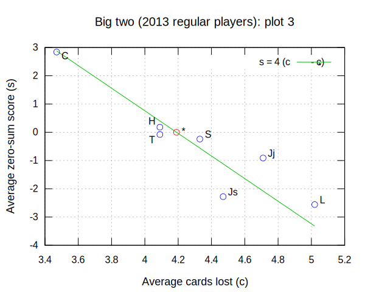

# Big two (鋤大弟) scoring statistics

A scorer for Big two, written in Python.

## Usage

Parse the Big two scores in `{scores file}.txt` and return a CSV of statistics:

    big-two-stats.py {scores file}

    big-two-stats.py {scores file} {end date}

    big-two-stats.py {scores file} {start date} {end date}

### Optional argument `-f` or `--fry` for frying threshold (default 10)

    big-two-stats.py {...} -f {frying threshold}

Frying threshold is the number of cards at which losses are doubled.
A loss of 13 cards is always tripled.

### Optional flag `-s` or `--sep` for displaying regular players separately

    big-two-stats.py {...} -s

Regular players are those who have played at least 1 in 4 games.

## Specifications for scores text file

1. Hash (`#`) **comments** out the remainder of a line
2. **Date** is specified by a line of digits `{yyyymmdd}`
   1. Extra digits are permitted but ignored
3. **Players** are specified by a line `{P1} {P2} {P3} {P4}`
   1. Whitespace can be any non-newline whitespace
   2. Player names cannot begin with a digit
   3. Player names cannot contain whitespace
   4. Player names cannot contain commas
   5. Player names cannot contain asterisks
4. **Losses** (i.e.&nbsp;**cards remaining**) are specified by a line
   `{L1} {L2} {L3} {L4}`
   1. Whitespace can be any non-newline whitespace
   2. Use suffix `t` if a player takes on all losses
      (for not playing high enough or failing to announce "last card")
5. Any other non-comment non-whitespace text is invalid

## Simple example

Running `big-two-stats.py scores` for the following [`scores.txt`](scores.txt)

    20190918

    a b c d
    0 11 12 13
    1 1 1 0

    e b c d
    3t 2 1 0 # Player e takes on all losses

results in the following output [`scores.csv`](scores.csv):

| player | games_played | cards_lost | games_won | games_fried | net_score | cards_lost_avg | games_won_pc | games_fried_pc | net_score_avg |
| --- | --- | --- | --- | --- | --- | --- | --- | --- | --- |
| a | 2 | 1 | 1 | 0 | 84 | 0.5 | 50.0 | 0.0 | 42.0 |
| e | 1 | 6 | 0 | 0 | -18 | 6.0 | 0.0 | 0.0 | -18.0 |
| b | 3 | 23 | 0 | 1 | 2 | 7.67 | 0.0 | 33.3 | 0.67 |
| c | 3 | 25 | 0 | 1 | -6 | 8.33 | 0.0 | 33.3 | -2.0 |
| d | 3 | 39 | 2 | 1 | -62 | 13.0 | 66.7 | 33.3 | -20.67 |
| * | 12 | 94 | 3 | 3 | 0 | 7.83 | 25.0 | 25.0 | 0.0 |

For more examples see the [/test/](test/) folder.

## Scores from 2013

I have transcribed the handwritten scores from 2013 into text format
for the scorer.
By running the scorer for each new day's worth of scores transcribed,
I discovered several mistakes in the calculations at the time. Apologies!
For details see [/2013/big-two-2013.txt](2013/big-two-2013.txt).

Back then I didn't do zero-sum scoring,
which is when each player pays each other player 1 unit per card they've lost.
So if the four players have losses `a`, `b`, `c`, `d`, then
`a`'s zero-sum score is

    (b + c + d) - 3 a = T - 4 a

where `T = a + b + c + d` is the total of all losses for that game.
To have a positive zero-sum score for a game you needn't win,
but only have a lower loss than the average loss `T / 4` for that game.

Using the scorer, I can now report that
* C averaged +2.84 per game;
* H averaged +0.18 per game; and
* All other regular players averaged a negative zero-sum score
  (see [Plot&nbsp;3](#average-cards-lost-vs-average-zero-sum-score) below).

For details see [/2013/big-two-2013-f-11-s.csv](2013/big-two-2013-f-11-s.csv).

Finally here are some interesting plots
(gnuplot code in the [/2013/](2013/) folder):

### Average cards lost VS Proportion of games won

### Average cards lost VS Proportion of games fried

### Average cards lost VS Average zero-sum score

The ideal relationship between cards lost `c` and zero-sum score `s` is
`s = T - 4 c = 4 (c_* - c)`, where
`T = 4 c_*` is the 4-player total cards lost average, and
`c_*` is the combined cards lost average, i.e. `cards_lost_avg` for `'*'`.

### Proportion of games won VS Average zero-sum score

